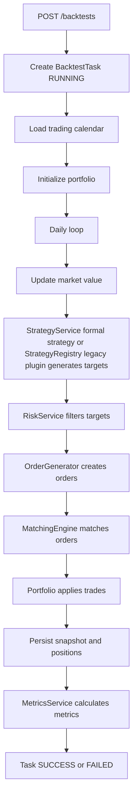

# AresQuant Backtest Engine

## Architecture

Phase 3 turns `BacktestModule` into a runnable A-share backtesting engine.

Main components:

- `BacktestEngineService`: orchestrates task lifecycle, trading calendar loop, formal strategy / legacy plugin signals, risk filtering, orders, matching, snapshots, and metrics.
- `MatchingEngineService`: simulates A-share matching rules.
- `PortfolioService`: manages cash, positions, T+1 availability, realized and unrealized PnL.
- `OrderGeneratorService`: creates rebalance orders from target weights.
- `FeeCalculatorService`: calculates commission, stamp duty, transfer fee, and total fee with Decimal.
- `SlippageService`: adjusts execution price.
- `MetricsService`: calculates performance metrics from account snapshots.
- Prisma repositories: persist tasks, snapshots, positions, orders, trades, and metrics.

## Execution Flow



## Strategy Integration

Phase 7 connects the formal `StrategyService` architecture to `BacktestEngineService` while keeping legacy plugin compatibility.

Resolution order:

1. `BacktestEngineService` first calls `StrategyService.get(strategyName)`.
2. If a formal strategy exists, it receives a `StrategyContext` built from the current backtest loop:
   - universe from the stock repository
   - current trade date and previous trade date
   - market data converted from daily bars
   - momentum scores derived from daily bar return
   - lightweight factor values for `momentum`, `volatility`, and `turnover`
   - current portfolio positions
3. If the formal strategy is not found, the engine falls back to legacy `StrategyRegistryService` plugins.

Formal strategies can be used directly in `POST /backtests` through `strategyName`:

- `equal-weight`
- `momentum-top-n`
- `multi-factor`

`strategyConfig` is optional. The engine always provides default `maxPositions`, `rebalanceDays`, `normalizeMethod: "rank"`, and a default momentum factor, then merges custom `strategyConfig` on top.

Legacy strategy names such as `equal_weight_mock` remain supported.

## Matching Rules

The matching engine supports:

- Suspended stock rejection.
- Limit-up buy rejection by default.
- Limit-down sell rejection by default.
- T+1 sell restriction.
- Insufficient cash rejection.
- Insufficient position rejection.
- 100-share lot-size validation.
- Market and limit order data model.
- Price modes: `OPEN`, `CLOSE`, `VWAP`, `NEXT_OPEN`.

Rejection reasons:

- `SUSPENDED`
- `LIMIT_UP`
- `LIMIT_DOWN`
- `T1_RESTRICTED`
- `INSUFFICIENT_CASH`
- `INSUFFICIENT_POSITION`
- `INVALID_LOT_SIZE`
- `PRICE_NOT_AVAILABLE`

## Fee Model

Default values:

- Commission rate: `0.00025`
- Minimum commission: `5`
- Stamp duty: `0.001`, sell only
- Transfer fee: `0.00001`

All fee calculations use `Decimal`.

## Slippage Model

- Buy execution price: `basePrice * (1 + slippageRate)`
- Sell execution price: `basePrice * (1 - slippageRate)`

## Performance Metrics

`MetricsService` calculates:

- Total return
- Annualized return
- Maximum drawdown
- Sharpe ratio
- Sortino ratio
- Calmar ratio
- Win rate
- Profit/loss ratio
- Annualized volatility
- Turnover rate
- Trade count
- Alpha/Beta as `null` when benchmark calculation is unavailable

## API Example

```powershell
Invoke-RestMethod -Uri http://localhost:3000/backtests `
  -Method Post `
  -ContentType 'application/json' `
  -Body '{
    "name":"Phase 3 Mock Backtest",
    "strategyName":"equal_weight_mock",
    "startDate":"2026-05-11",
    "endDate":"2026-05-15",
    "initialCapital":1000000,
    "benchmark":"000300.SH",
    "rebalanceFrequency":1,
    "maxPositions":2,
    "maxPositionWeight":0.5,
    "commissionRate":0.00025,
    "slippageRate":0.0005,
    "priceMode":"CLOSE",
    "strategyConfig":{
      "normalizeMethod":"rank",
      "factors":[{"factorCode":"momentum","weight":1,"direction":"positive"}]
    }
  }'
```

Query artifacts:

- `GET /backtests`
- `GET /backtests/:id`
- `GET /backtests/:id/orders`
- `GET /backtests/:id/trades`
- `GET /backtests/:id/positions`
- `GET /backtests/:id/snapshots`
- `GET /backtests/:id/metrics`

## Tests

```powershell
pnpm build
pnpm test
pnpm lint
```

Coverage includes fee calculation, slippage, matching rules, portfolio updates, order generation, metrics, engine failure handling, and controller response shape.
