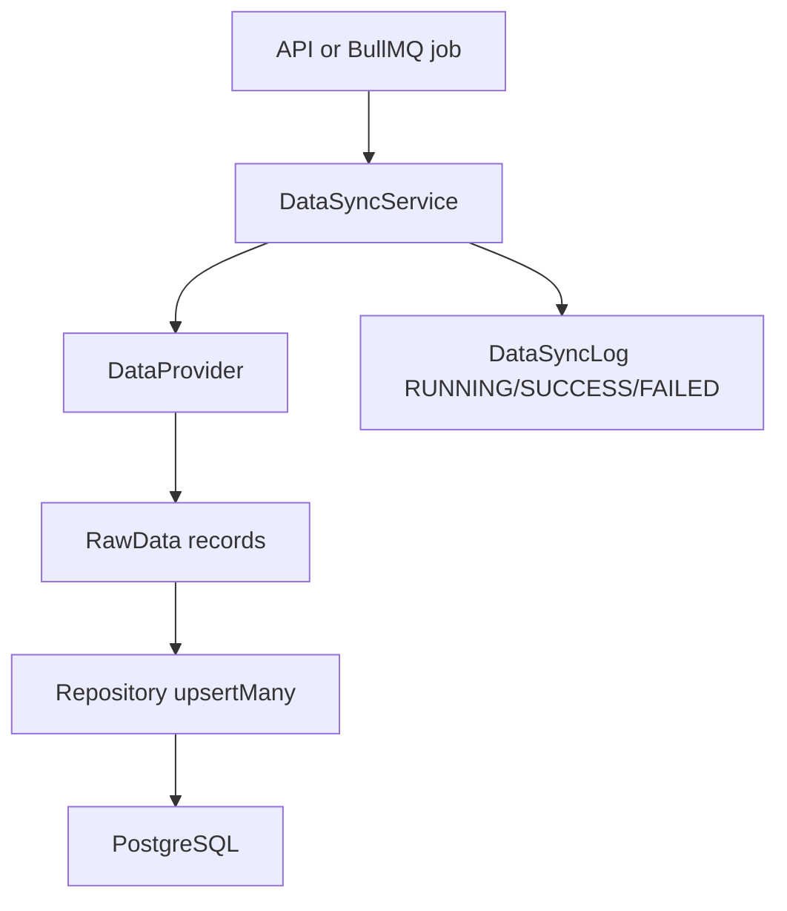

# AresQuant Data Module

## Data Models

Phase 2 adds production-oriented A-share data-center tables on top of the Phase 1 base schema:

- `stocks`: A-share security master data.
- `trading_calendars`: exchange calendars with open-day markers and previous trade date.
- `daily_bars`: stock OHLCV bars, keyed by `symbol + tradeDate`.
- `index_daily_bars`: index OHLCV bars.
- `limit_prices`: up/down limit price data.
- `suspensions`: suspension records and reasons.
- `adj_factors`: adjustment factors for forward/backward adjusted bars.
- `financial_factors`: valuation, profitability, leverage, and growth factors.
- `data_sync_logs`: durable task logs for all sync flows.

## Provider Interface

`DataProvider` is the only data-source boundary used by application services. It exposes methods for stocks, trading calendars, stock bars, index bars, limit prices, suspensions, adjustment factors, and financial factors.

Implemented provider:

- `MockDataProvider`: deterministic local data for development and tests.

Reserved providers:

- `TushareDataProvider`
- `AkShareDataProvider`

Both reserved providers currently inherit the mock provider so the module has no hard dependency on external APIs.

## Repository Layer

All database writes go through repository abstractions under `src/modules/data/domain/repositories`. Prisma implementations live under `src/modules/data/infrastructure/repositories`.

Each core repository supports:

- `upsertMany`
- `findBySymbol` where applicable
- `findByDateRange`
- `findLatestDate`
- `count`
- `deleteByDateRange`

Batch writes use `DATA_SYNC_BATCH_SIZE` and Prisma transactions.

## Sync Flow

Sync tasks:

- `syncStocks`
- `syncTradingCalendar`
- `syncDailyBars`
- `syncIndexDailyBars`
- `syncLimitPrices`
- `syncSuspensions`
- `syncAdjFactors`
- `syncFinancialFactors`
- `syncAll`

Partitioned tasks isolate failures so one symbol or day does not abort the whole job.

## Data Quality Rules

`DataQualityService` checks:

- OHLC relationship validity.
- Negative prices.
- Negative volume or amount.
- Missing bars on open trading days.
- Abnormal pct change: normal stock over 11%, ST stock over 6%.
- Duplicate bars.
- Missing adjustment factors.

Issues are returned as `DataQualityIssue` with severity and typed issue code.

## Adjustment Calculation

`AdjustmentService` supports:

- Forward adjusted bars.
- Backward adjusted bars.
- Single price adjustment via `price * factor / baseFactor`.

The service returns `AdjustedDailyBar` and never mutates the original raw bar objects.

## Queue

`DataQueueModule` uses BullMQ and Redis. Supported jobs:

- `sync-stocks`
- `sync-daily-bars`
- `sync-calendar`
- `sync-all`
- `quality-check`

Default retry behavior:

- `attempts = 3`
- exponential backoff
